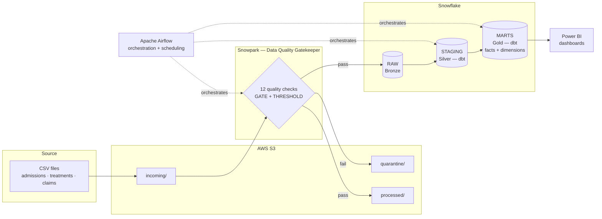
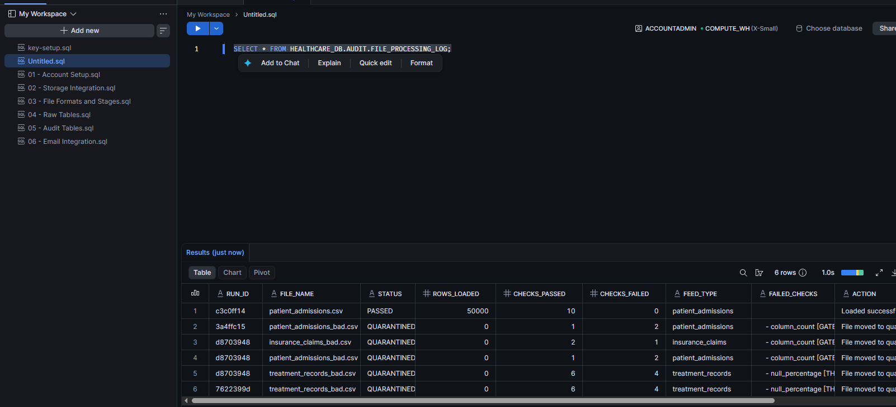
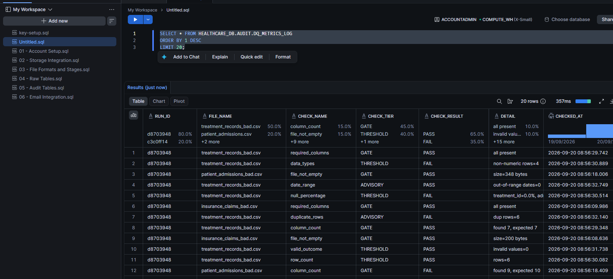
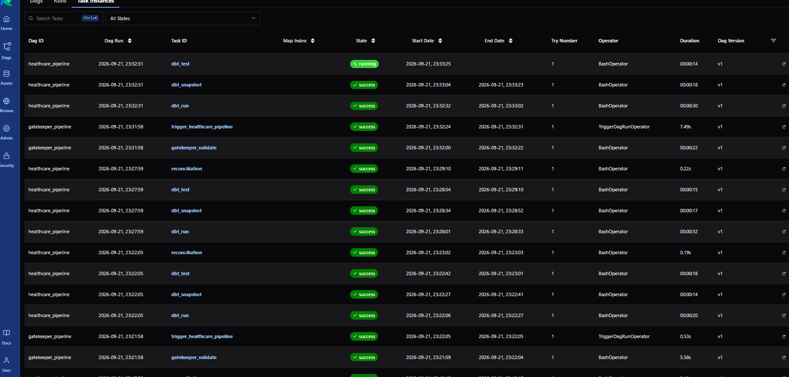
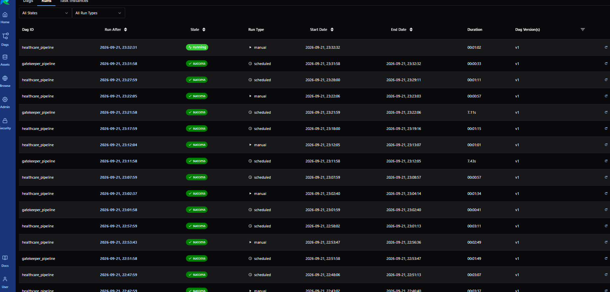

# Healthcare Analytics — End-to-End Medallion Data Pipeline

An end-to-end data engineering pipeline built to practice the full modern data stack: ingesting raw healthcare files, validating their quality before they ever touch a table, transforming them through a Bronze → Silver → Gold (medallion) architecture, orchestrating the whole thing on a schedule, and surfacing the results in a BI dashboard.

Built as a hands-on portfolio project, from account setup to a production-style, fully tested, orchestrated pipeline.

## Why this project

Most "data pipeline" tutorials stop at loading a CSV into a table. This one is built the way a real pipeline would need to be: it rejects bad data before it lands, tracks every decision it makes in an audit trail, is covered by automated tests, and runs unattended on a schedule — with alerting when something goes wrong.

## Architecture



**Flow summary:**

1. Raw CSV files (patient admissions, treatment records, insurance claims) land in an S3 `incoming/` bucket.
2. A **Snowpark-based gatekeeper** runs 12 automated quality checks against each file — a mix of hard **GATE** checks (e.g. required columns, column count — file is rejected outright) and **THRESHOLD** checks (e.g. null percentage, data types, primary-key uniqueness — file is rejected if it crosses a defined limit).
3. Files that pass move to `processed/` and are loaded into Snowflake's **RAW (Bronze)** layer; files that fail are routed to `quarantine/` with the specific reason logged to an audit table.
4. **dbt** transforms Bronze into a cleaned, typed **Silver (staging)** layer, then into a **Gold (marts)** layer modeled as a star schema (fact tables for admissions/treatments/claims, dimension tables for patients/doctors/hospitals/dates/insurance).
5. **Apache Airflow** orchestrates and schedules the full pipeline (gatekeeper → dbt run → dbt snapshot → dbt test → reconciliation), running in Docker.
6. **Power BI** connects to the Gold layer to build interactive dashboards for hospital operations and claims analysis.

## Tech stack

| Layer | Technology |
|---|---|
| Ingestion / landing | AWS S3 |
| Data quality gatekeeper | Snowflake Snowpark (Python) |
| Warehouse | Snowflake |
| Transformation & testing | dbt (dbt-core, dbt-snowflake) |
| Orchestration | Apache Airflow (Docker) |
| BI / visualization | Power BI |
| Auth | Key-pair (RSA) authentication to Snowflake |

## Data quality gatekeeper

The most important design decision in this pipeline: **nothing reaches the warehouse without being validated first.**

- **12 automated checks** per file, split into two severities:
  - `GATE` — structural checks (required columns present, correct column count). A failure here means the file is malformed and is rejected immediately, no further checks run.
  - `THRESHOLD` — statistical/quality checks (null percentage, data type conformance, primary-key uniqueness). A failure here means the file crossed an acceptable error rate.
- Every decision (pass, quarantine, and *why*) is written to a Snowflake audit table — full traceability of what was loaded, what wasn't, and the exact reason.
- Validated end-to-end with both "happy path" files and intentionally corrupted (`_bad`) versions of each source file, confirming the gatekeeper correctly quarantines each one for the expected reason.


*`patient_admissions.csv` passes all 10 checks and loads 50,000 rows; the five corrupted `_bad` files are each quarantined for a specific, logged reason.*


*Every individual check (GATE / THRESHOLD / ADVISORY) recorded per file, with pass/fail detail — full auditability down to the check level.*

## Testing

- **41 automated dbt tests** across staging and marts models (`not_null`, `unique`, `relationships`, `accepted_values`), all passing — covering referential integrity between facts and dimensions, valid categorical values, and primary-key uniqueness across the whole Gold layer.

## Orchestration

- Airflow DAG runs the pipeline end-to-end: `dbt_run → dbt_snapshot → dbt_test → reconciliation`, fully green from ingestion to tested marts.
- Snowflake authentication handled via RSA key-pair (no passwords in code or config).
- Automated email alerting on pipeline failures.

## Pipeline in action


*Every stage of the pipeline (`dbt_run`, `dbt_snapshot`, `dbt_test`, `reconciliation`, plus the gatekeeper's own validation and trigger tasks) completing successfully, run after run.*


*The pipeline running reliably end-to-end on a schedule, both scheduled and manually triggered runs, all green.*

## Dashboards

Interactive Power BI dashboard built on top of the Gold layer:

- KPI overview (total admissions, average length of stay)
- Admissions by hospital
- Admissions trend by month
- *(Claims analysis page — in progress)*

_Dashboard screenshot coming soon — formatting pass in progress._

_More screenshots: see [`docs/screenshots/`](docs/screenshots/)._

## Challenges solved along the way

A few real-world problems worked through during the build (kept here because they're often more informative than the happy path):

- **Local Docker port conflict** — resolved by remapping Airflow's exposed port instead of colliding with another local project's stack.
- **Out-of-memory failures during `dbt test`** on Docker/WSL2 — diagnosed and resolved a container memory allocation issue that was silently killing test runs.
- **RSA key-pair auth across environments** — same key referenced both by the local CLI and by the containerized Airflow DAGs, requiring careful path/mount management.
- **dbt test logic bug** — a `not_null` test on a surrogate key was failing due to a join edge case; fixed with a scoped `where` clause in the test config.
- **Hardcoded credentials from the reference repo** — found and removed a hardcoded alert email address left over from the original tutorial repository that this project was inspired by, replacing it with a securely configured value.

## Repository structure

```
├── code/                # Snowflake setup SQL (warehouse, storage integration, stages, RAW tables)
├── data/                # Sample source CSVs (incl. intentionally invalid _bad versions)
├── seeds/                # dbt seed reference data (doctors, hospitals, insurers)
├── snowpark/             # Data quality gatekeeper (Python/Snowpark)
├── models/
│   ├── silver/           # Cleaned, typed staging models
│   └── gold/              # Star schema: facts + dimensions
├── snapshots/             # dbt snapshots
├── macros/                 # dbt macros
├── airflow/                # DAGs + docker-compose for orchestration
└── docs/screenshots/        # Dashboard and pipeline screenshots
```

## Running this project

1. Create an AWS account (S3 bucket with `incoming/`, `processed/`, `quarantine/` folders) and a Snowflake account.
2. Run the setup scripts in `code/` in order (warehouse, database, storage integration, stages, RAW tables).
3. Configure `profiles.yml` for dbt locally (not committed — see `.gitignore`) and set the required environment variables for Snowflake auth.
4. `dbt deps && dbt seed && dbt run && dbt test`
5. Upload sample files to S3 `incoming/` and run the gatekeeper: `python snowpark/gatekeeper.py`
6. Bring up orchestration: `cd airflow && docker compose up -d`, then trigger the `healthcare_pipeline` DAG from the Airflow UI.

## About

Built as a guided, hands-on learning project covering the full data engineering lifecycle — cloud infrastructure setup, data quality engineering, warehouse modeling, transformation testing, orchestration, and BI — based on and extended from the open-source reference project [`data-24/Healthcare_Analytics`](https://github.com/data-24/Healthcare_Analytics).

**Author:** Pedro Sousa — Data Engineer
